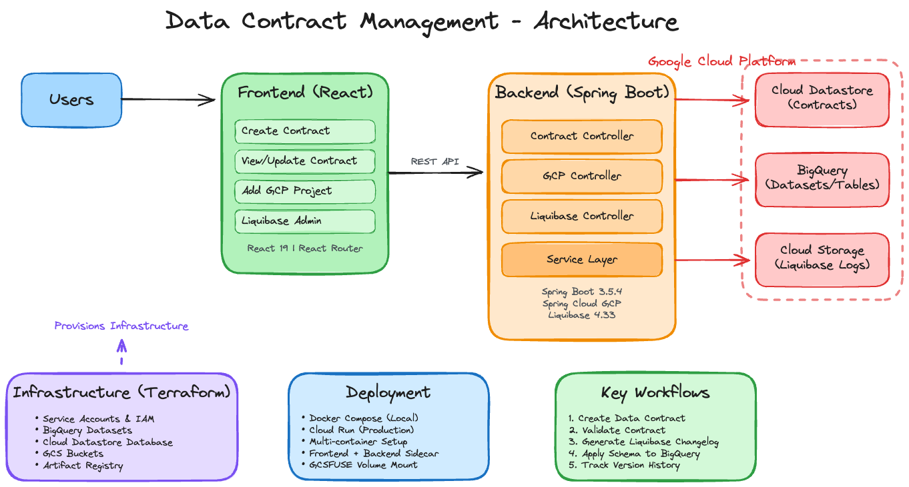

[](https://github.com/paragpratim/gcp-data-management/actions/workflows/build.yml) [](https://github.com/paragpratim/gcp-data-management/actions/workflows/terraform-validate.yml) [](https://github.com/paragpratim/gcp-data-management/actions/workflows/build-deploy-contract-app.yml) [](https://github.com/paragpratim/gcp-data-management/actions/workflows/deploy-terraform.yml)
# GCP Data Management - Data Contract Manager

A self-service application for managing data contracts and schemas in Google Cloud Platform (GCP). This application provides a comprehensive solution for creating, managing, and versioning data contracts with automated schema management using Liquibase for BigQuery.

## Architecture

### Architecture Diagram



The application consists of three main components:

### Backend (Spring Boot)
- **Framework**: Spring Boot 3.5.4 with Java 17
- **Storage**: Google Cloud Datastore (Firestore in Datastore mode)
- **Schema Management**: Liquibase with BigQuery extension
- **API Documentation**: OpenAPI/Swagger UI
- **Monitoring**: Spring Actuator health endpoints

### Frontend (React)
- **Framework**: React 19.1.1
- **Routing**: React Router DOM 7.8.0
- **UI**: Custom styled components
- **Build Tool**: Create React App

### Infrastructure (Terraform)
- **Resource Provisioning**: Automated GCP resource creation
- **Services**: BigQuery, Cloud Datastore, Cloud Storage, Artifact Registry, Cloud Run
- **Security**: IAM roles and service accounts

## Features

### Data Contract Management
- **Create Contracts**: Define data contracts with schema definitions
- **View Contracts**: Browse and inspect existing contracts
- **Update Contracts**: Modify contract specifications
- **Validation**: Contract validation before persistence

### GCP Integration
- **Project Management**: Add and manage GCP projects
- **BigQuery Integration**: List and interact with BigQuery datasets
- **Datastore Storage**: Persistent storage using Cloud Datastore

### Liquibase Administration
- **Generate Changelogs**: Create Liquibase changelogs from contract definitions
- **Apply Changes**: Execute schema changes in BigQuery
- **Version Control**: Track schema evolution over time
- **Log Storage**: Changelog files stored in Google Cloud Storage

### Infrastructure as Code
- **Automated Provisioning**: Terraform modules for complete infrastructure setup
- **Service Account Management**: Automated IAM role assignments
- **API Enablement**: Required GCP APIs automatically enabled
- **Resource Organization**: Labels and structured resource naming

## Project Structure

```
.
├── contract-application/          # Spring Boot backend
│   ├── common-model/             # Shared data models
│   └── services/                 # REST API services
│       └── src/main/java/com/fusadora/
│           ├── contract/         # Contract management
│           ├── gcp/              # GCP integration
│           └── liquibase/        # Liquibase operations
├── contract-ui/                  # React frontend
│   └── src/
│       └── components/           # UI components
│           ├── CreateContract.js
│           ├── ViewContract.js
│           ├── UpdateContract.js
│           ├── AddProject.js
│           └── LiquibaseAdmin.js
├── terraform/                    # Infrastructure as Code
│   └── modules/
│       └── contract-application/ # Main module
├── sample-data/                  # Sample data files
│   ├── avro/                     # Avro format samples
│   ├── json/                     # JSON format samples
│   └── parquet/                  # Parquet format samples
├── docker-compose.yml            # Local development setup
├── contract-app-cloud-run.yml    # Cloud Run deployment config
└── Taskfile.yml                  # Task automation
```

## Prerequisites

### Development Environment
- **Java**: JDK 17 or higher
- **Maven**: 3.6+ (or use included Maven wrapper)
- **Node.js**: 16+ and npm
- **Docker**: For containerized deployment
- **Task**: Task runner (optional, for using Taskfile)

### Google Cloud Platform
1. **GCP Account**: Active GCP account with billing enabled
2. **GCP CLI**: Install from [Google Cloud CLI](https://cloud.google.com/sdk/docs/install)
3. **Terraform**: Download from [Terraform website](https://www.terraform.io/downloads.html)
4. **GCP Project**: Create a GCP project for the application
5. **Service Account**: Create with the following roles:
   - `roles/bigquery.admin`
   - `roles/datastore.owner`
   - `roles/storage.admin`
   - `roles/artifactregistry.writer`

## Getting Started

### 1. Infrastructure Setup

Navigate to the `terraform/` directory and configure your variables:

```bash
cd terraform
# Edit variables.tf or create terraform.tfvars
terraform init
terraform plan
terraform apply
```

Required variables:
- `project_id`: Your GCP project ID
- `region`: GCP region (e.g., `us-central1`)
- `datastore_database_id`: Datastore database name
- `my_domain`: Your domain for IAP access
- `bigquery_datasets`: List of BigQuery datasets to create

### 2. Local Development Setup

#### Option A: Using Task (Recommended)

```bash
# Install all dependencies, build, and run
task all

# Or run individual tasks
task install-jdbc-driver   # Install BigQuery JDBC driver
task build-backend          # Build Spring Boot application
task build-frontend         # Build React application
task docker-build           # Build Docker images
task docker-up              # Start containers
```

#### Option B: Manual Setup

**Backend:**
```bash
cd contract-application
# Install BigQuery JDBC driver
cd services/local-repo
mvn install:install-file -Dfile=GoogleBigQueryJDBC42-1.5.4.1008.jar \
  -DgroupId=com.simba.googlebigquery.jdbc \
  -DartifactId=GoogleBigQueryJDBC42 \
  -Dversion=1.5.4 \
  -Dpackaging=jar \
  -DgeneratePom=true
cd ../..
# Build application
./mvnw clean install
```

**Frontend:**
```bash
cd contract-ui
npm install
npm run build
```

**Run with Docker Compose:**
```bash
docker-compose up
```

### 3. Access the Application

- **Frontend UI**: http://localhost:80
- **Backend API**: http://localhost:8080
- **API Documentation**: http://localhost:8080/swagger-ui.html
- **Health Check**: http://localhost:8080/actuator/health

## API Endpoints

### Contract Management
- `POST /api/contracts/save` - Create or update a contract
- `GET /api/contracts/get/{contractId}` - Get contract by ID
- `GET /api/contracts/all` - List all contracts
- `GET /api/contracts/all-ids` - List all contract IDs
- `GET /api/contracts/exists/{contractId}` - Check if contract exists
- `POST /api/contracts/validate` - Validate contract structure

### GCP Operations
- `POST /api/gcp/saveProject` - Register a GCP project
- `GET /api/gcp/getProjects` - List registered projects
- `GET /api/gcp/getBigQueryDatasets/{gcpProjectId}` - List BigQuery datasets

### Liquibase Operations
- `POST /api/liquibase/generateChangelog/{contractId}` - Generate changelog
- `POST /api/liquibase/applyChangelog/{contractId}` - Apply schema changes

## Deployment to Cloud Run

### Build and Push Images

```bash
# Build images
docker build -t ${REGION}-docker.pkg.dev/${PROJECT_ID}/data-management/contract-ui:latest ./contract-ui
docker build -t ${REGION}-docker.pkg.dev/${PROJECT_ID}/data-management/contract-application:latest ./contract-application

# Push to Artifact Registry
docker push ${REGION}-docker.pkg.dev/${PROJECT_ID}/data-management/contract-ui:latest
docker push ${REGION}-docker.pkg.dev/${PROJECT_ID}/data-management/contract-application:latest
```

### Deploy to Cloud Run

```bash
# Set environment variables in contract-app-cloud-run.yml
export ARTIFACT_REGISTRY="${REGION}-docker.pkg.dev/${PROJECT_ID}/data-management"
export LIQUIBASE_LOG_BUCKET="liquibase-log-${PROJECT_ID}"
export PROJECT_ID="your-project-id"
export SPRING_CLOUD_GCP_DATASTORE_PROJECT_ID="your-project-id"
export SPRING_CLOUD_GCP_DATASTORE_DATABASE_ID="your-datastore-db"

# Deploy using gcloud
gcloud run services replace contract-app-cloud-run.yml --region=${REGION}
```

The application uses a multi-container setup with:
- **Frontend container**: NGINX serving React app (port 80)
- **Backend sidecar**: Spring Boot application (port 8080)
- **Shared storage**: GCS bucket mounted via GCSFUSE for Liquibase logs

## Configuration

### Backend Configuration

Application properties are located in `contract-application/services/src/main/resources/`:
- `application.properties` - Base configuration
- `application-dev.properties` - Development profile
- `application-prod.properties` - Production profile

Key configurations:
```properties
# Server
server.port=8080

# GCP Datastore
spring.cloud.gcp.datastore.project-id=your-project-id
spring.cloud.gcp.datastore.database-id=your-datastore-db

# Liquibase
liquibase.enabled=false  # Managed via API
```

### Frontend Configuration

API endpoint configuration in `contract-ui/src/config.js`:
```javascript
export const API_BASE_URL = process.env.REACT_APP_API_URL || 'http://localhost:8080';
```

## Sample Data

Sample data files are provided in `sample-data/` for testing:
- **Avro**: Schema files (`.avsc`) and data files (`.avro`)
- **JSON**: Sample JSON datasets
- **Parquet**: Sample Parquet files

## Development

### Running Tests

**Backend:**
```bash
cd contract-application
./mvnw test
```

**Frontend:**
```bash
cd contract-ui
npm test
```

### Clean Build

```bash
# Using Task
task clean

# Manual
cd contract-application && mvn clean
cd contract-ui && rm -rf node_modules build
docker-compose down -v
```

## Technology Stack

### Backend
- Spring Boot 3.5.4
- Spring Cloud GCP 7.1.0
- Liquibase 4.33.0 with BigQuery extension
- Google Cloud BigQuery Java Client
- Google Cloud Datastore
- SpringDoc OpenAPI 2.2.0

### Frontend
- React 19.1.1
- React Router DOM 7.8.0
- React Testing Library

### Infrastructure
- Terraform
- Docker & Docker Compose
- Google Cloud Run (with multi-container support)
- Google Cloud Storage (GCSFUSE)
- Google Artifact Registry

## Monitoring and Observability

- **Health Checks**: Available at `/actuator/health`
- **Application Metrics**: Spring Actuator endpoints
- **Cloud Run Monitoring**: Automatic logging and monitoring in Google Cloud Console
- **Startup/Liveness Probes**: Configured for both frontend and backend containers

## Security

- **Service Account**: Dedicated service account with minimal required permissions
- **IAM Integration**: Cloud Run uses workload identity
- **API Security**: Can be extended with Cloud IAP
- **Network Security**: Configurable ingress controls

## Troubleshooting

### Backend Issues
- Check logs: `docker-compose logs backend`
- Verify GCP credentials and permissions
- Ensure Datastore database is created
- Confirm BigQuery API is enabled

### Frontend Issues
- Check logs: `docker-compose logs app`
- Verify API endpoint configuration
- Check browser console for errors

### Deployment Issues
- Verify Artifact Registry images are pushed
- Check Cloud Run service logs
- Ensure service account has required permissions
- Verify environment variables are set correctly

## Contributing

1. Fork the repository
2. Create a feature branch
3. Commit your changes
4. Push to the branch
5. Create a Pull Request

## License

See [LICENSE](LICENSE) for license information.
